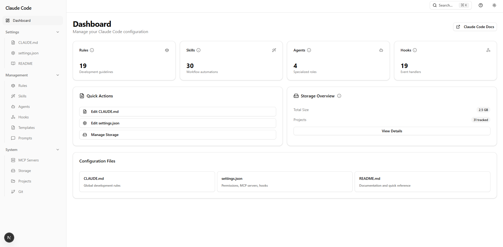
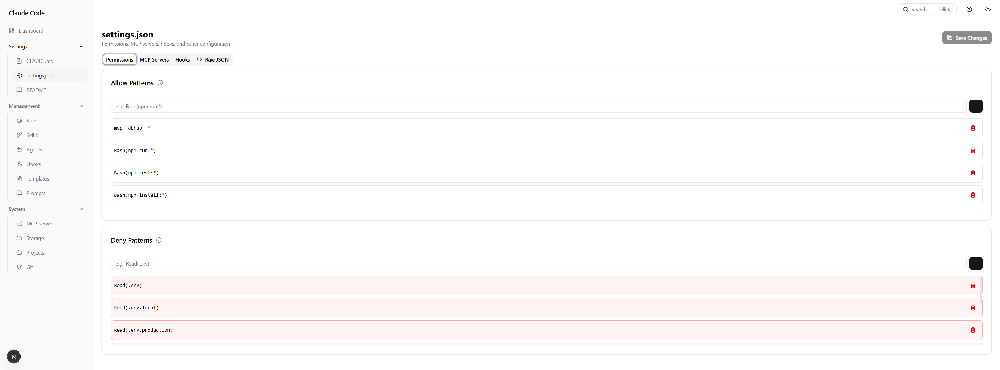
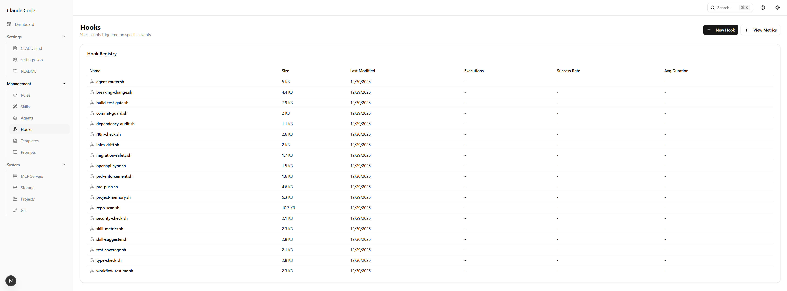
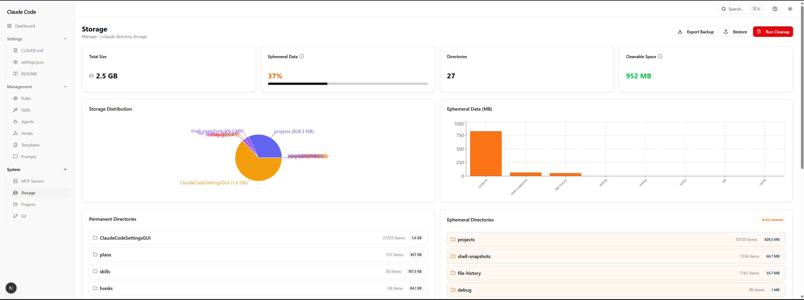
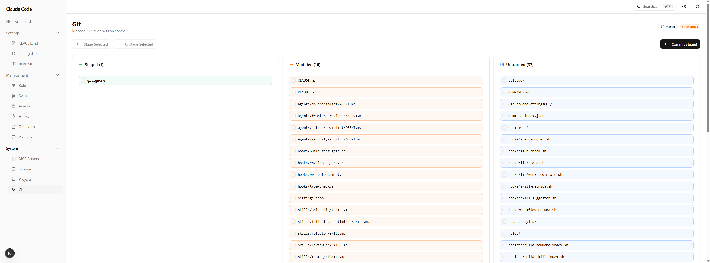
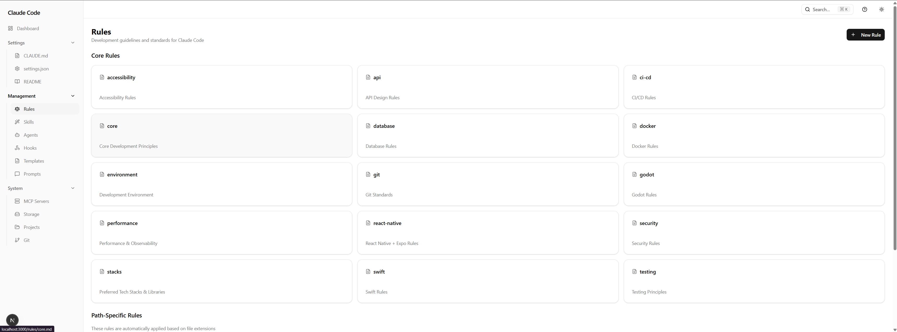
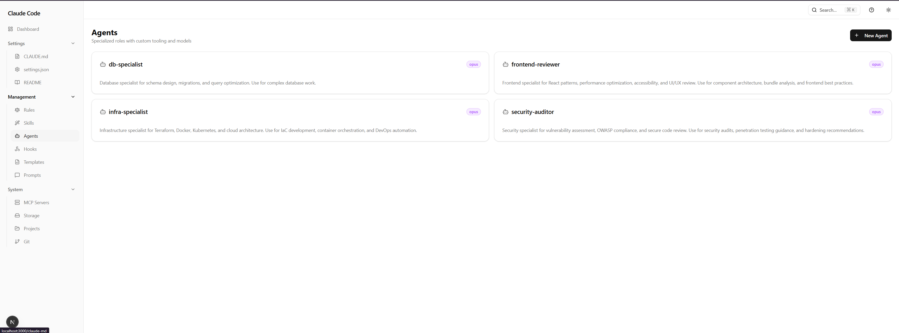

# Claude Code Settings GUI

> **Stop editing JSON files. Start building.**

A beautiful, visual dashboard for managing your entire Claude Code configuration — rules, skills, hooks, agents, and more.



## Why Use This?

Managing Claude Code means editing scattered files across `~/.claude/`:
- `CLAUDE.md` for instructions
- `settings.json` for permissions and hooks
- Individual files for skills, rules, agents...

**This GUI gives you one place to see and edit everything**, with:
- Live preview for Markdown files
- Syntax highlighting for JSON
- Automatic backups before every save
- Visual metrics for hook performance

## Features

### Dashboard
Get a bird's-eye view of your entire Claude Code setup.


### Skills & Rules Management
Browse, search, and edit your workflow automations with live preview.


### Settings Editor
Multi-tab interface for permissions, MCP servers, and hooks — no more manual JSON editing.



### Hook Metrics
See which hooks fire most often, track success rates, and debug failures.



### Storage Management
Visualize what's taking up space and clean up with one click.



### Git Integration
Stage, commit, and manage your `~/.claude` repository without leaving the GUI.



## Quick Start

### Option 1: npx (Recommended)
```bash
npx claude-code-settings-gui
```

### Option 2: Clone & Run
```bash
git clone https://github.com/DailyDisco/claude-code-settings-gui.git
cd claude-code-settings-gui
npm install
npm run dev
```

Then open [http://localhost:3000](http://localhost:3000).

## Features at a Glance

| Feature | Description |
|---------|-------------|
| **CLAUDE.md Editor** | Edit global instructions with live Markdown preview |
| **Settings.json Editor** | Visual tabs for permissions, MCP servers, hooks |
| **Skills Browser** | View, edit, and create workflow automations |
| **Rules Manager** | Manage core and path-specific development rules |
| **Agents Dashboard** | Configure specialized AI agents |
| **Hooks Registry** | Monitor hook scripts with execution metrics |
| **Storage Analysis** | Visualize disk usage with cleanup tools |
| **Git Integration** | Full git workflow without terminal |
| **Dark Mode** | Easy on the eyes |
| **Auto-Backup** | Every save creates a backup first |

## Tech Stack

Built with modern tools for performance and developer experience:

- **Framework**: Next.js 16 + React 19
- **Styling**: TailwindCSS 4 + ShadCN UI
- **Editor**: Monaco Editor (VS Code's editor)
- **State**: TanStack Query
- **Validation**: Zod
- **Charts**: Recharts

## Screenshots

<details>
<summary>View all screenshots</summary>

### Dashboard


### Skills Editor


### Settings Editor


### Rules Manager


### Agents


### Storage


### Git


</details>

## Roadmap

- [x] Dashboard with stats
- [x] Skills/Rules/Agents management
- [x] Settings.json visual editor
- [x] Hook metrics dashboard
- [x] Storage analysis & cleanup
- [x] Git integration
- [x] Dark mode
- [ ] Create new skills/rules/agents
- [ ] Template gallery with pre-built configs
- [ ] Import/export configurations
- [ ] Real-time file watching
- [ ] Keyboard shortcuts (Cmd+K palette)

## Contributing

Contributions welcome! Please read our contributing guidelines first.

```bash
# Development
npm run dev

# Build
npm run build

# Lint
npm run lint
```

## License

MIT

---

<p align="center">
  Made for the Claude Code community
</p>
