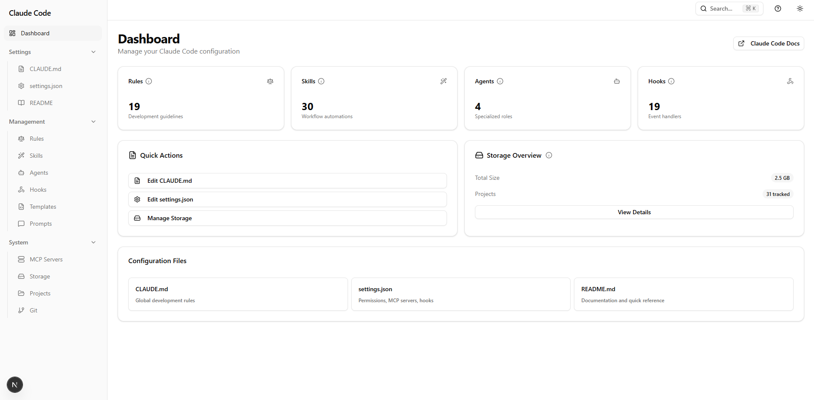

# Claude Code Settings GUI

> **Stop editing JSON files. Start building.**

A visual dashboard for managing your entire Claude Code configuration — rules, skills, hooks, agents, workflows, plans, MCP servers, plugins, and more.



## Why use this?

`~/.claude/` is where Claude Code lives, and it grows fast: `CLAUDE.md` for instructions, `settings.json` for permissions and hooks, directories for skills/rules/agents/hooks/commands/output-styles/workflows/templates/prompts, plus an MCP server registry, plugin registry, usage stats, hook metrics, history, plans, backups, caches...

This GUI gives you **one place to see and edit everything**, with:
- Live Markdown preview for everything that's markdown
- Schema-driven editors for `settings.json` and `settings.local.json`
- Automatic backups before every save + a browser to restore them
- Hook execution metrics + usage charts (recharts)
- Sensitive file masking with reveal-with-confirmation
- Live file watching → UI auto-refreshes when you edit on disk
- Cmd+K command palette + g-style jump shortcuts
- Audit log of every change made through the GUI

## Quick start

### Option 1 — npx (recommended)

```bash
npx claude-code-settings-gui
# point at a custom config dir:
npx claude-code-settings-gui --config-dir /path/to/.claude
# pick a port:
npx claude-code-settings-gui --port 4000
# preview-only demo mode (no writes):
npx claude-code-settings-gui --demo
```

### Option 2 — clone and run

```bash
git clone https://github.com/DailyDisco/claude-code-settings-gui.git
cd claude-code-settings-gui
npm install
npm run dev
```

### Option 3 — Docker

```bash
docker compose up -d
# or with a custom config dir:
CLAUDE_CONFIG_DIR=~/work/.claude docker compose up -d
```

Open [http://localhost:3000](http://localhost:3000).

### Configuration

| Setting | CLI flag | Env var | Default |
|---|---|---|---|
| Claude config directory | `--config-dir` / `-c` | `CLAUDE_CONFIG_DIR` | `~/.claude` |
| Port | `--port` / `-p` | `PORT` | `3000` |
| Demo mode (read-only) | `--demo` | `NEXT_PUBLIC_DEMO_MODE=true` | off |

## Feature matrix

The sidebar has 6 top-level sections. Each lands on its first tab; the rest live in a tab strip across the top of the section.

### Overview
| Section | Path | What it does |
|---|---|---|
| Dashboard | `/` | Health strip (config / git / hooks), counts, quick launcher, recent activity, storage breakdown |

### Config
| Section | Path | What it does |
|---|---|---|
| CLAUDE.md | `/config/claude-md` | Edit global instructions |
| settings.json | `/config/settings-json` | General (model, statusLine, thinking, teams, attribution), Permissions (allow/deny/ask/additionalDirectories), MCP Servers, Hooks, Plugins, Raw JSON |
| settings.local.json | `/config/settings-local` | Machine-specific overrides |
| README | `/config/readme` | Edit README.md |
| Host | `/config/host` | Edit HOST.md (machine-specific docs) |
| Architecture | `/config/system-architecture` | Edit SYSTEM_ARCHITECTURE.md |

### Artifacts
| Section | Path | What it does |
|---|---|---|
| Rules | `/artifacts/rules` | Browse + edit `rules/*.md` (path-specific auto-loaded) |
| Skills | `/artifacts/skills` | Browse + edit + create + delete `skills/*/SKILL.md` |
| Agents | `/artifacts/agents` | Manage `agents/*/AGENT.md` with model selector |
| Hooks | `/artifacts/hooks` | Edit shell scripts in `hooks/` |
| Commands | `/artifacts/commands` | Edit slash commands in `commands/` |
| Output Styles | `/artifacts/output-styles` | Edit response styles |
| Workflows | `/artifacts/workflows` | Multi-step orchestration markdown |
| Templates | `/artifacts/templates` | Built-in gallery + custom templates + URL import + starter packs |
| Prompts | `/artifacts/prompts` | Curated analysis prompts |

### Integrations
| Section | Path | What it does |
|---|---|---|
| MCP Servers | `/integrations/mcp-servers` | Installed + registry + auth status tabs |
| Plugins | `/integrations/plugins` | Toggle enabled plugins |
| Projects | `/integrations/projects` | Per-project session memory, bulk-delete by age |
| Git | `/integrations/git` | Status / stage / commit / push the `~/.claude` repo |

### Data
| Section | Path | What it does |
|---|---|---|
| Files | `/data/files` | Generic file browser with sensitive-file reveal flow |
| Plans | `/data/plans` | Read-only browser for session plans |
| Storage | `/data/storage` | Pie chart, ephemeral data, cache cleaner, backup/restore |
| Backups | `/data/backups` | Restore `.backup.{ts}` files, bulk-delete old |

### Insights
| Section | Path | What it does |
|---|---|---|
| Usage Stats | `/insights/usage-stats` | recharts dashboard: daily activity, tokens by model, top hooks |
| Slash Commands | `/insights/commands-index` | Read-only catalog of every slash command |
| Hook Metrics | `/insights/hooks` | Hook execution counts, success rate, latency |
| History | `/insights/history` | Search past prompts in `history.jsonl` |
| Audit Log | `/insights/audit` | Every change made through the GUI |

## Security & privacy

Everything runs locally. No telemetry, no remote calls except those your config explicitly makes (MCP servers, GitHub imports, etc.).

**Sensitive files** — `.env`, `.credentials.json`, `*.key`, `*.pem`, anything matching `*secret*`/`*token*`/`*password*` — are masked by default. Revealing requires:
1. Explicit confirmation in a modal
2. A short-lived single-use server-issued token
3. Auto re-hide after 60 seconds or when you switch tabs

Demo mode never serves sensitive contents.

**Audit log** records every write/delete made through the GUI to `.gui-audit.jsonl`. Combined with the automatic `.backup.{ts}` files that get created before every save, every change is reversible.

## Keyboard shortcuts

| Combo | Action |
|---|---|
| `⌘K` / `Ctrl+K` | Command palette |
| `?` | Show shortcut help |
| `g d` | Dashboard |
| `g s` | Skills |
| `g r` | Rules |
| `g a` | Agents |
| `g h` | Hooks |
| `g c` | CLAUDE.md |
| `g j` | settings.json |
| `g u` | Usage Stats |
| `g b` | Backups |
| `g f` | Files |
| ...etc | Press `?` for the full list |

## Tech stack

- **Framework**: Next.js 16 + React 19
- **Styling**: Tailwind CSS 4 + ShadCN UI
- **Editor**: Monaco Editor
- **State**: TanStack Query
- **Validation**: Zod
- **Charts**: Recharts
- **Search**: cmdk + Fuse.js
- **Testing**: Vitest + @testing-library/react

## Roadmap

Done:
- [x] Dashboard with stats and config-status banner
- [x] First-class editors for CLAUDE.md, README, SYSTEM_ARCHITECTURE.md, HOST.md
- [x] Full schema-driven settings.json + settings.local.json
- [x] Skills / Rules / Agents / Hooks / Commands / Output Styles / Workflows / Templates / Prompts
- [x] MCP server registry + auth status
- [x] Live file watcher → auto-refresh
- [x] Hook metrics + usage stats charts
- [x] Backup browser with restore
- [x] Storage analyzer + cache cleaner
- [x] Plans browser
- [x] Plugins toggle
- [x] Files browser with sensitive-file reveal flow
- [x] History search
- [x] Audit log
- [x] Slash commands index
- [x] Command palette + g-style jump shortcuts
- [x] Configurable `CLAUDE_CONFIG_DIR`
- [x] Docker support
- [x] Test suite (Vitest)
- [x] Dark mode

Next:
- [ ] Live schema validation (highlight unknown keys before save)
- [ ] Export selected sections as a sharable `.tar.gz` with secrets stripped
- [ ] Marketplace browser for plugins
- [ ] Tasks / Todos managers (when these dirs have content to manage)

## Development

```bash
npm run dev         # dev server
npm run build       # production build
npm run start       # production server
npm run lint        # ESLint
npm test            # Vitest
npm run typecheck   # TypeScript --noEmit
```

See [CONTRIBUTING.md](CONTRIBUTING.md) for project structure, conventions, and "how to add a new section".

## License

MIT

---

<p align="center">
  Made for the Claude Code community
</p>
